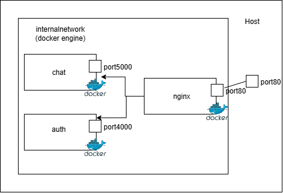

# Demo App Dockerized

Here, we have two backend apps, a chat application and an auth application which communicate with the frontend. The whole setup is run by Nginx as a web proxy, and a web server, because I used a HTML file served by Nginx for the frontend. The frontend can as well be another container running Node with all the Next.js files (or whatever javascript library or framework).



## Creating versions

The workflow for building and pushing images to container registry (in this case, Docker Hub) is triggered either manually from the Actions tab or by release. The idea was that you have to be ready to have a new version of the app, not that as developers are committing, it's building too many versions which may not be ideal.

It's then supposed to take the tag of the release and use it for the tag of the images. Hence, you have your versions.

## Deployment
To deploy, run `docker compose up -f docker-compose-deploy.yml && docker compose -f docker-compose-deploy.yml up`. This will pull the images and deploy them on your computer.

To deploy on a VM like AWS EC2 or Digital Ocean Droplet, add the following secrets to GitHub,SERVER_USER, SERVER_HOST, and SSH_PRIVATE_KEY.And then run the deployment workflow `deploy.yml` from the GitHub UI.

### Selecting versions to deploy

For the deployment, the .env file on the computer or server is used to determine the version to deploy.

The deployment workflow here has `${TAG}` that has to be passed in. So, your .env file should have

```env 
TAG=v1.0.0

# OR

TAG=v2.0.0

```

Something like that. The tag tells Docker Compose which versions to pull and run.